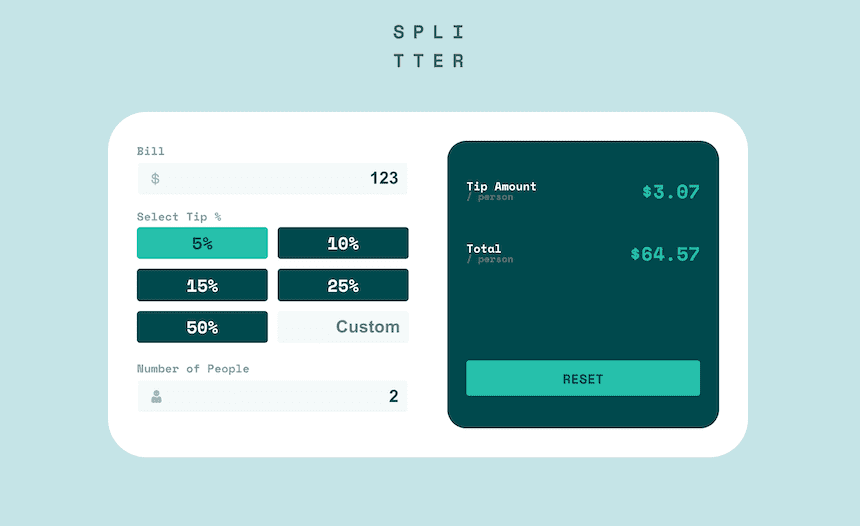

# Frontend Mentor - Tip calculator app solution

This is a solution to the [Tip calculator app challenge on Frontend Mentor](https://www.frontendmentor.io/challenges/tip-calculator-app-ugJNGbJUX).

## Table of contents

- [Overview](#overview)
  - [The challenge](#the-challenge)
  - [Screenshot](#screenshot)
  - [Links](#links)
- [Built with](#built-with)
- [Author](#author)

## Overview

### The challenge

Users should be able to:

- View the optimal layout for the app depending on their device's screen size
- See hover states for all interactive elements on the page
- Calculate the correct tip and total cost of the bill per person

### Screenshot

### Links

- Solution: [URL](https://github.com/mathieu-superpose/tip-calculator-app)
- Live Site: [URL](https://mathieu-superpose.github.io/tip-calculator-app/)

## Built with

- Semantic HTML5 markup
- SCSS custom properties
- Flexbox
- CSS Grid
- Mobile-first workflow
- Javascript (DOM)

## Author

- Website - [Mathieu JOLY](http://www.tropbeau.site/)
- Frontend Mentor - [@mathieu-superpose](https://www.frontendmentor.io/profile/mathieu-superpose)
